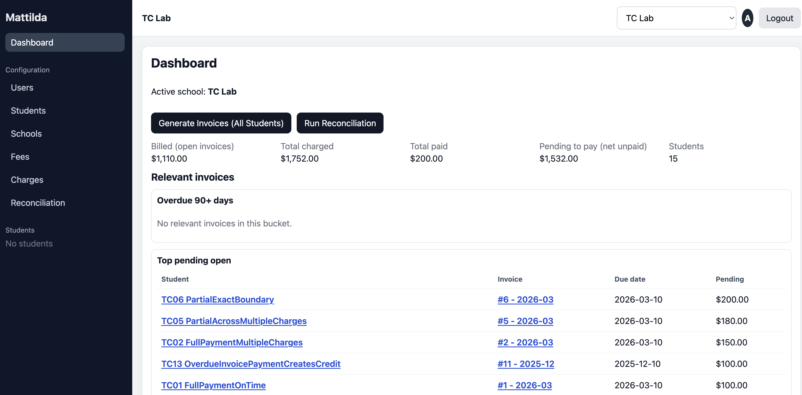

# Mattilda Take-Home Project Setup



Starter environment for a take-home exercise with:

- Backend: Python + FastAPI + Celery
- Database: PostgreSQL + SQLAlchemy ORM
- Cache: Redis
- Frontend: React (Vite)
- Containers: Docker + Docker Compose
- Python dependency management: `uv` + `pyproject.toml`
- Tests: `pytest` for backend
- API docs: OpenAPI/Swagger via FastAPI
- Directory style: Hexagonal architecture-inspired layering
- Multi-tenant model: School-based isolation with PostgreSQL RLS
- Student model: many-to-many user/student and student/school associations
- Charge/Payment/Invoice model: only one invoice open for student
- Invoice Generator process
- Conciliation proccess

## Live links

- FE demo app: https://frontend-production-600b.up.railway.app/
- API docs (ReDoc): https://api-production-5dcd.up.railway.app/redoc
- API: https://api-production-5dcd.up.railway.app/

## Project structure

```text
.
├── backend/
│   ├── app/
│   │   ├── domain/
│   │   ├── application/
│   │   ├── infrastructure/
│   │   └── interfaces/
│   ├── alembic/
│   ├── scripts/
│   └── tests/
├── frontend/
└── docker-compose.yml
```

## Run with Docker Compose

1. Initialize local environment file:

   ```bash
   make up
   make migrate
   make seed
   ```

2. Verify:

- Frontend: http://localhost:13000
- Backend: http://localhost:18000
- Dummy API endpoint: http://localhost:18000/api/v1/ping
- Swagger docs: http://localhost:18000/docs
- Celery worker: `docker compose logs -f celery_worker`
- OAuth token endpoint: `POST /api/v1/auth/token`
- Schools endpoint: `GET /api/v1/schools`

3. Stop services:

   ```bash
   make down
   ```

## Run backend tests

```bash
make test
```

Tests run locally (from your host machine) with `uv`, and use a real PostgreSQL container via `testcontainers`.
Ensure both `uv` and Docker are available locally before running tests.

## Code quality checks

```bash
make lint
make format
make typecheck
make quality
```

- `make lint`: runs `ruff check` on backend `app` and `tests`.
- `make format`: runs `ruff format` on backend `app` and `tests`.
- `make typecheck`: runs `mypy` on backend `app`.
- `make quality`: runs lint + typecheck + full tests.

### Local test prerequisites

1. Install `uv` (if not installed):

   ```bash
   curl -LsSf https://astral.sh/uv/install.sh | sh
   ```

2. Reload your shell (or open a new terminal):

   ```bash
   source ~/.zshrc
   ```

3. Verify `uv`:

   ```bash
   uv --version
   ```

4. Ensure Docker Desktop (or Docker daemon) is running before `make test`.

## Makefile shortcuts

Use `make help` to see all available commands.

```bash
make init-env
make up
make migrate
make seed
make test
make down
```

## Reviewer quick guide

If you only have a few minutes, follow this path:

1. Start everything:
   ```bash
   make up
   make migrate
   make seed
   ```
2. Open:
   - Frontend: http://localhost:13000
   - Swagger: http://localhost:18000/docs
3. Run tests:
   ```bash
   make test
   ```
4. Review key implementation decisions:
   - `CONSIDERATIONS.md`
   - `TEST.md`

### Suggested manual checks

- **Billing lifecycle (`tc-lab`)**
  - Log in as `admin@example.com` / `admin123`.
  - Switch to school `tc-lab`.
  - Open `Configuration > Students` and search `TC-XX`.
  - Validate invoice generation and payment behavior across seeded cases.

- **Reconciliation workflow (`reconciliation-lab`)**
  - Switch to school `reconciliation-lab`.
  - Run reconciliation from dashboard or `Configuration > Reconciliation`.
  - Validate findings are generated and visible in run details.

- **Visibility rules (`visibility-lab`)**
  - Use `teacher@example.com` / `teacher123` and `student@example.com` / `student123`.
  - Confirm teacher sees assigned students and student sees only own record.

## Related docs

- Design rationale and tradeoffs: `CONSIDERATIONS.md`
- Manual test scenarios and expected outcomes: `TEST.md`
